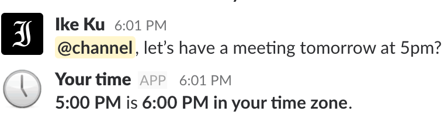

Slack time zone bot that integrates into your workspace and converts all
mentions of time to time zones of users in a channel and shows them a personal
message. If user hasn't defined time zone in their profile, the bot will convert
time to UTC time zone for them.

### 🖼 How does it look like in Slack?
Well... it's very simple — one message visible only to one person.

### 🛠 How to use?
0. You'll need [node.js](https://nodejs.org) and [yarn](https://yarnpkg.com/lang/en/docs/install/);
1. Run `yarn install` in the root to install dependencies;
2. Create and install to your workspace an Slack app by following
   [official Slack instructions](https://api.slack.com/slack-apps#creating_apps)
3. Naviagte to `OAuth & Permissions` tab of your bot and add `chat:write:bot`
   and `users:read` OAuth Scopes;
4. Obtain Slack `Bot User OAuth Access Token` from that page;
5. Run bot via `TOKEN={BOT_TOKEN} yarn start`;
6. Inivite the bot to channels where you want to use it;
7. Done :)

  made with ❤️ by <a href="https://github.com/dempfi">@dempfi</a>

